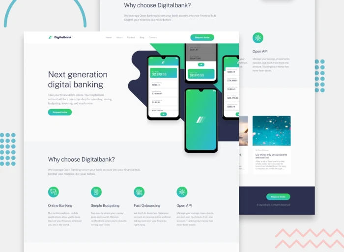

📖 Overview
✅ The challenge

Users should be able to:

View the optimal layout depending on their device (mobile & desktop).

See hover states for all interactive elements.

📸 Screenshot

🔗 Links

Solution URL: Frontend Mentor Solution

Live Site URL: Live Demo

🛠️ My process
### Built with

## 👨‍💻 Author

- [Frontend Mentor – @ronalty](https://www.frontendmentor.io/profile/ronaltyfernandes)
- [GitHub – Ronalty Fernandes](https://github.com/ronaltyfernandes)