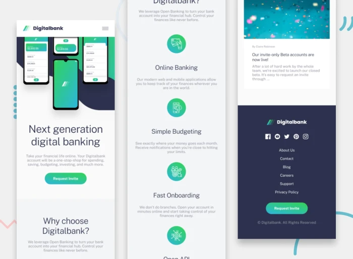

# 💳 DigitalBank

**DigitalBank** is a digital banking homepage built with **React** and **JavaScript**.  
The design was provided by **Frontend Mentor** and the implementation was done by me, **Ronalty Fernandes**.  
The project is fully **responsive**, featuring **dynamic cards** and **hover effects**, optimized for **mobile** and **desktop**.  
Focused on practicing **React** and **Tailwind CSS**.

---

## 📖 Overview

### ✅ The challenge
Users should be able to:

- View the optimal layout for their device (mobile & desktop).  
- See hover states for all interactive elements.  

---

## 📸 Screenshots

### Desktop

### Mobile

---

## 🔗 Links

- [Solution URL](https://www.frontendmentor.io/solutions/put-your-solution-link-here)  
- [Live Site URL](https://ronaltyfernandes.github.io/DigitalBank/)  

---

## 🛠️ My process

### Built with

  
  
  
  
  

---

## 👨‍💻 Author

- [Frontend Mentor – @ronalty](https://www.frontendmentor.io/profile/ronaltyfernandes)  
- [GitHub – Ronalty Fernandes](https://github.com/ronaltyfernandes)  
